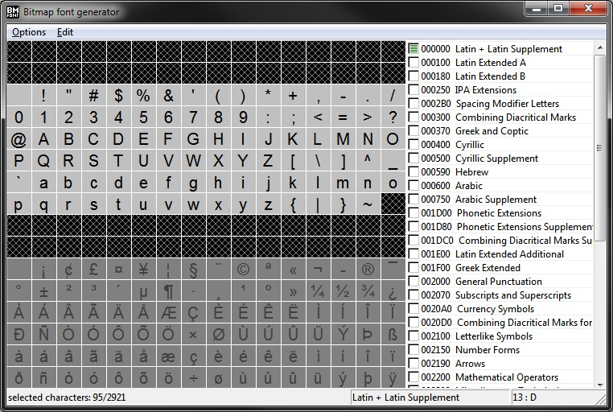
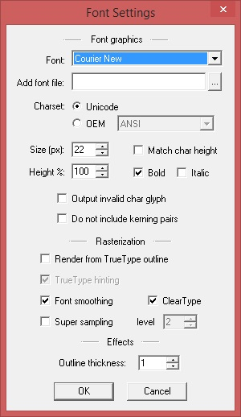
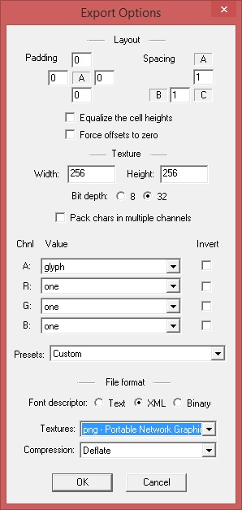
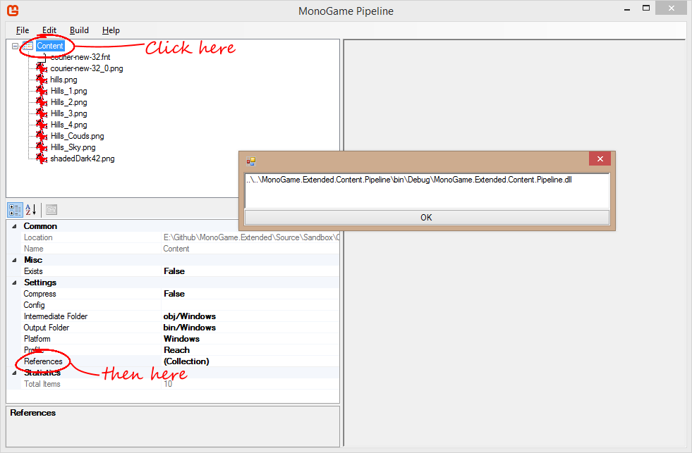
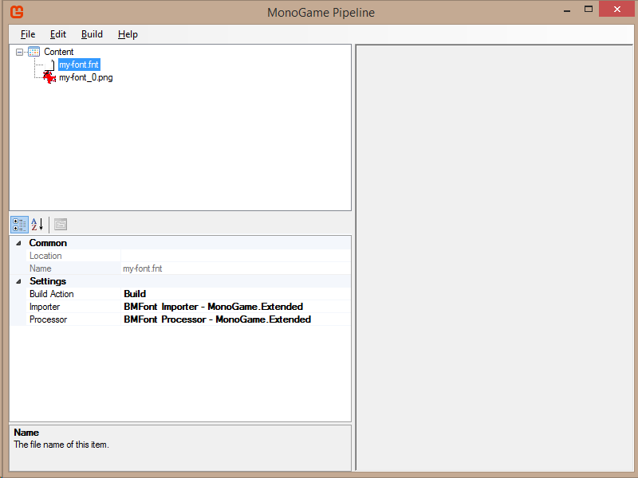
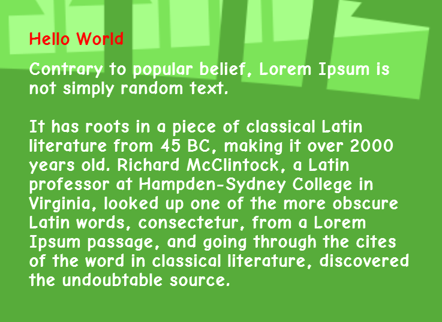

# Bitmap Fonts

Bitmaps fonts generated with the [BMFont](http://www.angelcode.com/products/bmfont/) tool are a great alternative to using the built in `SpriteFont` in MonoGame. There are a couple of reasons you might want to do this, either `SpriteFont`'s are not working out for you or you want to have more control over the fonts in your game.

The `BitmapFont` class in [MonoGame.Extended](https://github.com/craftworkgames/MonoGame.Extended) is designed to be a drop in replacement for the `SpriteFont` class as much as possible. The goal is to take a `.fnt` file and texture generated with the BMFont tool and load it into our game just like any other content. 

    _bitmapFont = Content.Load<BitmapFont>("my-font");

Then render some text just like any other string.

    _spriteBatch.Begin();
    _spriteBatch.DrawString(_bitmapFont, "Hello World", new Vector2(100, 200), Color.Red);
    _spriteBatch.End();

But before we can do that, we'll need to generate our bitmap font file.

## Generating the font file with BMFont

If you haven’t already done so, download and install the [BMFont](http://www.angelcode.com/products/bmfont/) tool. 

The main window of BMFont displays all of the characters of the font. You'll need to click and drag over the characters to highlight them in white, these are the characters that will be saved to the exported texture. Typically you will take all of the top half and ignore the bottom half, although, you may only want to take a smaller subset to reduce texture size requirements.

To choose a font click **Options** => **Font Settings** or hit the **F** key. You can pretty much choose whatever settings you like here.

Close that dialog and make sure all your desired characters are highlighted in white. 

Next click **Options** => **Export Options** or hit the **T** key. The important thing here is setting the file format to **XML** and getting the texture width and height right. It's preferable to fit the entire font on a single texture (although not required) and it can sometimes take a little tweaking.

I also recommend using **PNG** textures, **32 bit depth** and the **White text with alpha** preset, but it's up to you. Play around with the settings for different effects.

Once you're done with the settings you can click **Options** => **Visualize** or hit the **V** key to see a preview of how the texture will be packed.

Finally, click **Options** -> **Save bitmap font as** or hit **Ctrl+S** to export the font file. The textures will also be saved at this location, you'll need to add both of these to your game's content.  

## Building the font file with the MonoGame Pipeline

We need to load the font file into the game, but first we need to add a reference to the `MonoGame.Extended.Content.Pipleine.dll` that comes with an importer and processor for BMFont files.  

Once the reference is added, you can add the font file and texture to the content. If all goes well, the importer and processor should be selected automatically.

Don't forget to **Rebuild** your content.

## Rendering text in your game

If you've referenced the `MonoGame.Extended.dll` from your game project the code is pretty straightforward.

First load the font into an instance of a `BitmapFont` variable.

    _bitmapFont = Content.Load<BitmapFont>("my-font");

Then in your `Draw` method use the `DrawString` extension method to render some text much like you would with a traditional `SpriteFont`.

    _spriteBatch.Begin();
    _spriteBatch.DrawString(_bitmapFont, "Hello World", new Vector2(50, 50), Color.Red);
    _spriteBatch.DrawString(_bitmapFont, 
        "Contrary to popular belief, Lorem Ipsum is not simply random text.\n\n" + 
        "It has roots in a piece of classical Latin literature from 45 BC, " + 
        "making it over 2000 years old. Richard McClintock, a Latin professor" + 
        " at Hampden-Sydney College in Virginia, looked up one of the more obscure Latin " + 
        "words, consectetur, from a Lorem Ipsum passage, and going through the cites of " + 
        "the word in classical literature, discovered the undoubtable source.", 
        new Vector2(50, 100), new Color(Color.White, 0.5f), _viewportAdapter.VirtualWidth - 50);
    _spriteBatch.End();

And observe the result! :)

Happy coding! :)

